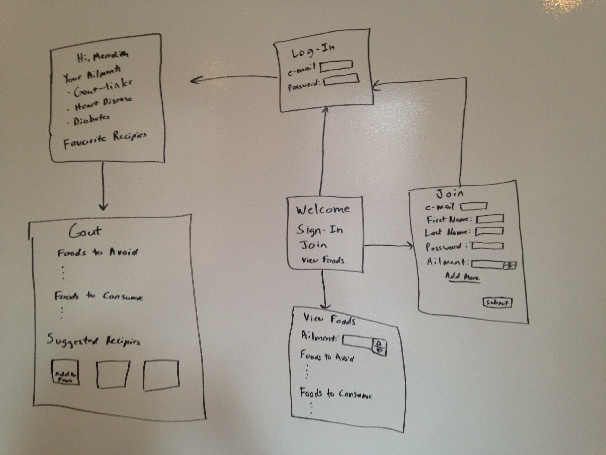
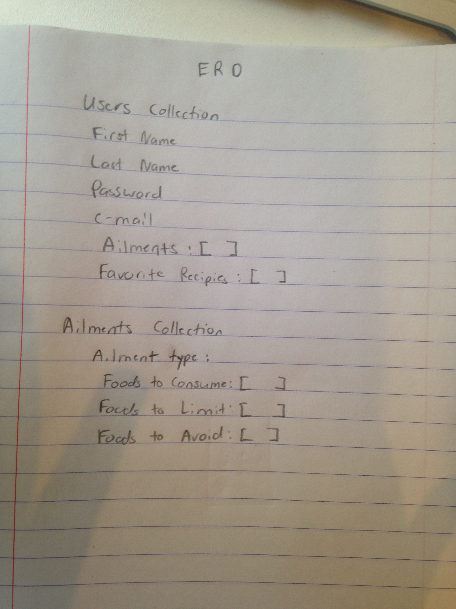

# aliment_with_ailments

###Description###
Food is an essentail part of healing and nutrition. This app will allow users to select/choose from a list of ailments they may have.  The app will then list foods they should try to avoid and foods they should strive to eat as well as suggest recepies with those foods in it.  For example people with gout shoud try to avoid eating pork but should consume sweet potatoes. Recepies including sweet potatoes would be offered to the user along with other foods good for gout.

###User Stories###

####MVP
#####Users Who are not Logged In
A user who is not logged in will be able to either join the website or navigate to the aliments page.  There they will be able to select from an already existing dropdown menu of various possible ailments they wish to see information about.  Only one ailment may be selected at a time.  Once the ailment is selected a list of foods to avoid, limit, and consume will be provided.

#####Users Who are Logged In
Once logged in a User will be directed to their ailments page, where a list of all their ailments exists.  The user may choose to add or delete ailments.  The user can click on any of the ailments and see a page specific to the ailment clicked.  Lists of foods to avoid, limit, or consume specific to this ailment will be shown along with suggested recepies that can be added to favorites.  At anypoint after the user is logged in they can navigate to their favorite recipes page to see what they have added. Users should be able to delete recipes from page.

####Nice to Have
Once the user is logged in and directed to the ailments page a list of foods to avoid, limit, and consume will be at the bottom of the page.  These lists will be foods that are approved by all diet restrictions for all the ailments. The user will also see a list of suggested recipes based on these suggested foods to consume.  When the user clicks on the specific ailment page there will be articles of the most up to date research on those ailments.  User can share favorite recipes with other users.  Users can receive an e-mail of a recipe of the day.  User can search through suggested recipes based on cuisine.

###Technologies##
* node.js
* mongo.db
* express
* angular
* food API from spoonacular
* SendGrid
* ActionMailer
* Heroku

###WireFrames###

###ERD###

